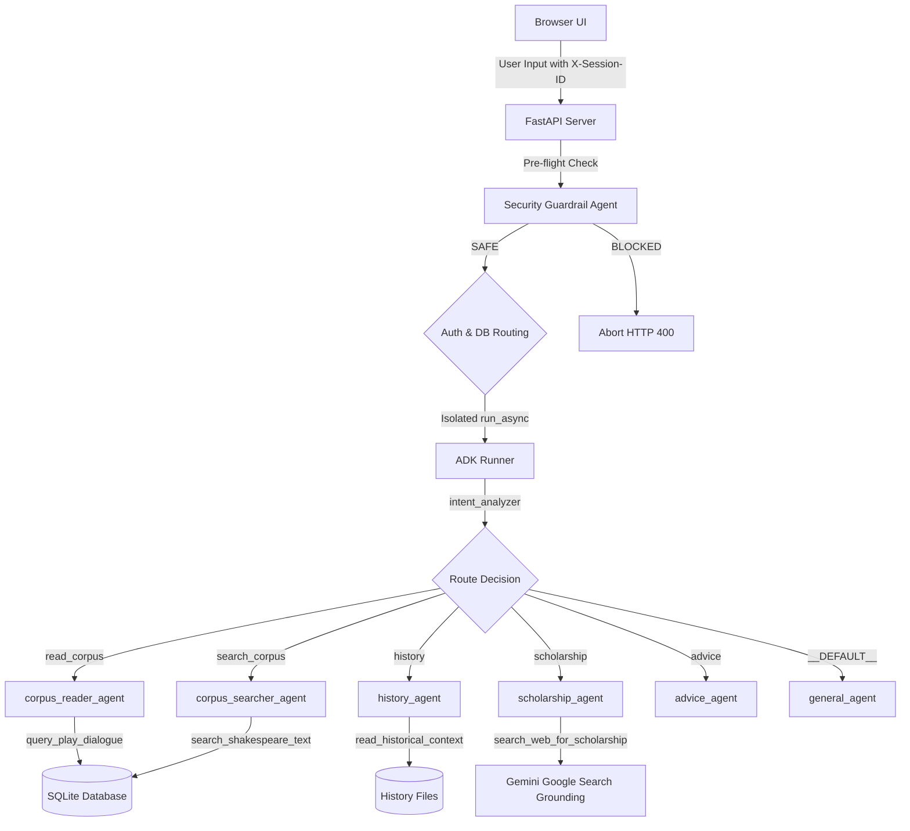
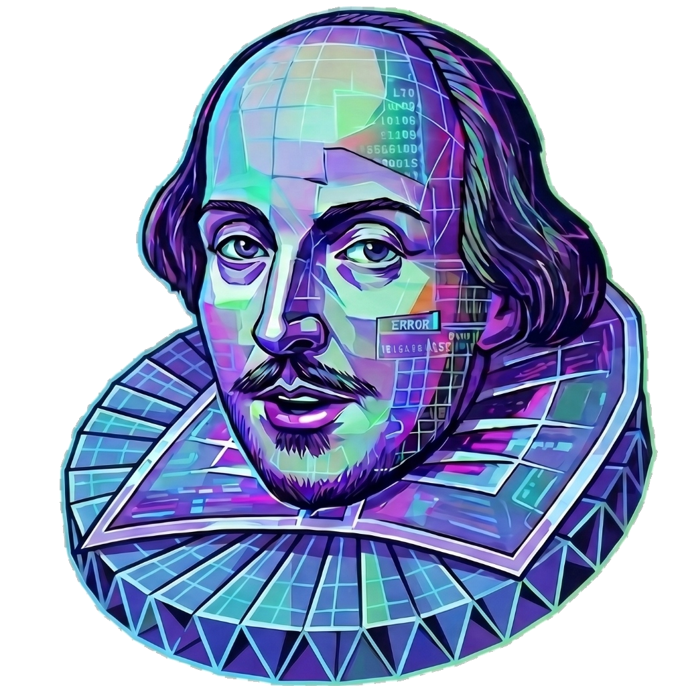

# Shakespeare AI: Scholar Studio

An intelligent, multi-agent workspace that bridges four centuries of literary genius with modern agentic computing and real-time current events critique.

This prototype demonstrates how local textual databases can be safely queried alongside real-time internet-grounded news analysis, co-developed with the **Antigravity** developer agent and styled with a drifting, retro-cybernetic Shakespeare visual companion.

---

## 🎭 The Problem

Exposing classical literary archives to public browser interfaces creates serious technical and security challenges:
1. **Fragmented Context:** Scholars lack a unified environment to explore local texts alongside real-time news events, geopolitical updates, and climate changes.
2. **Security Vulnerabilities:** Public input systems are highly vulnerable to prompt injection, system instruction bypass, and model hijacking.
3. **Session Bleeding:** Stateless containers (like Cloud Run) suffer from session leaks and lack isolated telemetry records for concurrent sessions.
4. **API Token Drainage:** Continuous caching tasks or hot-reloading backend servers can drain API tokens rapidly due to duplicate requests.
5. **Viewport Scrolling Freezes:** Desktop-centric layouts frequently freeze scrolls and lock elements off-screen on touch-momentum mobile viewports (e.g., Pixel 8).

---

## 🛠️ The Solution

Shakespeare AI resolves these limitations through a secure, decoupled, and mobile-optimized architecture:
1. **Multi-Agent Orchestration (ADK):** Uses the **Agent Development Kit (ADK)** to build a structured `Workflow` graph containing specialized subagents (Corpus Reader, Corpus Searcher, History Scholar, Scholarship Agent, Advice Agent, and General Chat).
2. **Session-Isolated Telemetry:** Client-side UUIDs are generated on load and passed in custom `X-Session-ID` headers. The FastAPI backend isolates database operations and telemetry logs (IP, location, scroll progress, and queries) for each separate session.
3. **Semantic Safety Guardrails:** A pre-flight check intercepts user inputs, using a safety-tuned Gemini model to block prompt injections before they propagate.
4. **Intelligent Caching:** Implements background loops that check cache age to prevent duplicate token drainage on hot-restarts.
5. **Fluid Mobile Layouts:** Fluid overflow styling handles responsive touch-momentum scrolling on mobile devices without element lockups.
6. **Max Headroom Visual Companion:** A transparent, digital floating Shakespeare head sways and bounces dynamically in the background of the application.

---

## 📐 Architecture & Multi-Agent Flow

The system coordinates conversational intents and tool execution via the following workflow:



### Visual Companion
The application features a floating, bouncing digital portrait of William Shakespeare sways in the background, mimicking the iconic Max Headroom cybernetic glitch style.



---

## 🚀 Setup & Installation

### Prerequisites
Before you begin, ensure you have:
* **uv:** Python package manager — [Install uv](https://docs.astral.sh/uv/getting-started/installation/)
* **agents-cli:** Agents CLI — Install with:
  ```bash
  uv tool install google-agents-cli
  ```
* **Google Cloud SDK:** Authorized to your GCP account — [Install GCloud](https://cloud.google.com/sdk/docs/install)
* **Application Default Credentials (ADC):** Run `gcloud auth application-default login` to establish credentials.

### Local Installation

1. **Clone and Initialize the Repository:**
   ```bash
   cd shakespeare
   agents-cli install
   ```

2. **Initialize the SQLite Database and History Records:**
   ```bash
   uv run python setup_data.py
   ```

3. **Configure Environment Variables:**
   Create a `.env` file in the root directory:
   ```env
   GEMINI_API_KEY=your-api-key-here
   GEMINI_MODEL=gemini-2.5-flash
   ```

4. **Launch the Playground:**
   ```bash
   agents-cli playground
   ```
   Open your browser and navigate to `http://localhost:8000` to interact with the Scholar Studio.

---

## 🛠️ CLI Development Commands

| Command | Purpose |
|---------|---------|
| `agents-cli playground` | Launches local development environment with hot-reloading |
| `agents-cli lint` | Runs code quality checks (Ruff check, Ruff format, Codespell, Ty) |
| `uv run pytest tests/unit` | Executes unit and integration test suites |
| `agents-cli deploy` | Builds the Docker container and deploys to Google Cloud Run |

---

## 🧬 Code Specifications & Technology Stack

* **Framework:** FastAPI backend paired with Vanilla HTML5/CSS3/JS frontend.
* **Agentic Framework:** Google Agent Development Kit (ADK) graph workflow.
* **Developer Agent:** Antigravity (automated environment setup, mobile touch scrolling fixes, and assets optimization).
* **MCP Integration:** Used the `google-developer-knowledge` MCP server during development to retrieve configurations for Secret Manager and Cloud Run invoker configurations.
* **Testing:** Integrated pytest checking authentication integrity, PBKDF2 cryptography, and injection safety rules.
